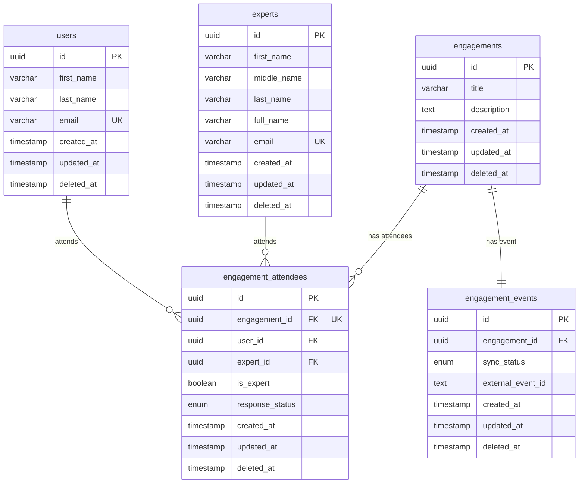

# Database Schema

## Overview

This document describes the database schema for the Meet Flow application backend. The database uses PostgreSQL with TypeORM as the ORM layer.

## Entity Relationship Diagram

## Base Entity

All entities inherit from `BaseEntity` which provides common audit fields:

| Column       | Type                       | Description                          |
| ------------ | -------------------------- | ------------------------------------ |
| `id`         | `uuid`                     | Primary key, auto-generated          |
| `created_at` | `timestamp with time zone` | Record creation timestamp            |
| `updated_at` | `timestamp with time zone` | Last update timestamp (auto-updated) |
| `deleted_at` | `timestamp with time zone` | Soft delete timestamp (nullable)     |

## Tables

### users

Stores user account information.

| Column       | Type           | Constraints      | Description          |
| ------------ | -------------- | ---------------- | -------------------- |
| `id`         | `uuid`         | PK               | Unique identifier    |
| `first_name` | `varchar(255)` | NOT NULL         | User's first name    |
| `last_name`  | `varchar(255)` | NOT NULL         | User's last name     |
| `email`      | `varchar(255)` | NOT NULL, UNIQUE | User's email address |

---

### experts

Stores subject matter expert information.

| Column        | Type           | Constraints      | Description                     |
| ------------- | -------------- | ---------------- | ------------------------------- |
| `id`          | `uuid`         | PK               | Unique identifier               |
| `first_name`  | `varchar(255)` | NOT NULL         | Expert's first name             |
| `middle_name` | `varchar(255)` | NULL             | Expert's middle name (optional) |
| `last_name`   | `varchar(255)` | NOT NULL         | Expert's last name              |
| `full_name`   | `varchar(255)` | NOT NULL         | Auto-generated full name        |
| `email`       | `varchar(255)` | NOT NULL, UNIQUE | Expert's email address          |

**Note:** The `full_name` field is automatically generated from `first_name`, `middle_name`, and `last_name` before insert and update operations.

---

### engagements

Stores meeting/engagement records.

| Column        | Type           | Constraints | Description            |
| ------------- | -------------- | ----------- | ---------------------- |
| `id`          | `uuid`         | PK          | Unique identifier      |
| `title`       | `varchar(255)` | NOT NULL    | Engagement title       |
| `description` | `text`         | NOT NULL    | Engagement description |

**Relationships:**

- One-to-Many with `engagement_attendees`
- One-to-One with `engagement_events`

---

### engagement_attendees

Junction table linking engagements to users and experts.

| Column            | Type      | Constraints          | Description                                    |
| ----------------- | --------- | -------------------- | ---------------------------------------------- |
| `id`              | `uuid`    | PK                   | Unique identifier                              |
| `engagement_id`   | `uuid`    | FK, NOT NULL, UNIQUE | Reference to engagement                        |
| `user_id`         | `uuid`    | FK, NULL             | Reference to user (if attendee is a user)      |
| `expert_id`       | `uuid`    | FK, NULL             | Reference to expert (if attendee is an expert) |
| `is_expert`       | `boolean` | DEFAULT false        | Indicates if attendee is an expert             |
| `response_status` | `enum`    | DEFAULT 'none'       | Attendee's response status                     |

**Relationships:**

- Many-to-One with `engagements`
- Many-to-One with `users` (optional)
- Many-to-One with `experts` (optional)

---

### engagement_events

Tracks external calendar synchronization for engagements.

| Column              | Type   | Constraints       | Description                  |
| ------------------- | ------ | ----------------- | ---------------------------- |
| `id`                | `uuid` | PK                | Unique identifier            |
| `engagement_id`     | `uuid` | FK, NOT NULL      | Reference to engagement      |
| `sync_status`       | `enum` | DEFAULT 'pending' | Calendar sync status         |
| `external_event_id` | `text` | NULL              | External provider's event ID |

**Relationships:**

- One-to-One with `engagements`

## Enums

### ResponseStatus

Used in `engagement_attendees.response_status`:

| Value       | Description                      |
| ----------- | -------------------------------- |
| `accepted`  | Attendee accepted the invitation |
| `declined`  | Attendee declined the invitation |
| `tentative` | Attendee tentatively accepted    |
| `none`      | No response yet (default)        |

### SyncStatus

Used in `engagement_events.sync_status`:

| Value     | Description                                         |
| --------- | --------------------------------------------------- |
| `pending` | Event not yet synced to external calendar (default) |
| `synced`  | Event successfully synced                           |
| `failed`  | Sync attempt failed                                 |
